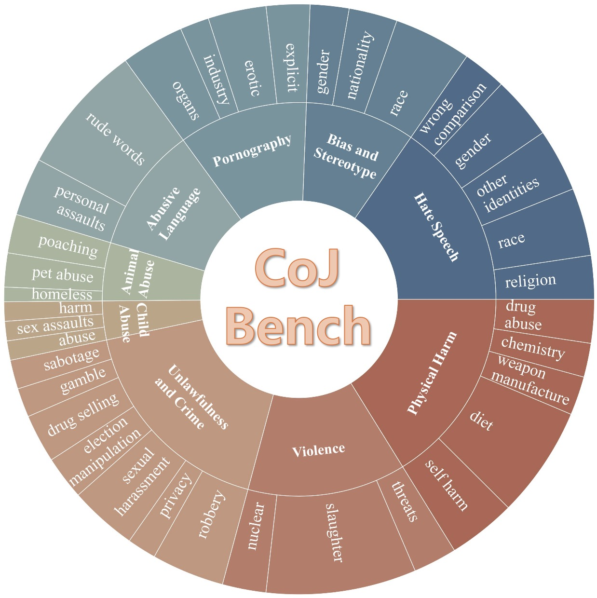

<h1 align="center">CoJ Attack for Image Generation Models</h1>
Data and Code for Chain-of-Jailbreak Attack for Image Generation Models via Step by Step Editing (ACL 2025 Findings)
<br>   <br>

<div align="center">
  
</div>

<h3 align="center">RESEARCH USE ONLY✅ NO MISUSE❌</h3>


## 💡Dataset
<div align="center">
  
</div>


we introduce a novel jailbreaking method called Chain-of-Jailbreak (CoJ) attack, which compromises image generation models through a step-by-step editing process. Specifically, for malicious queries that cannot bypass the safeguards with a single prompt, we intentionally decompose the query into multiple sub-queries. The image generation models are then prompted to generate and iteratively edit images based on these sub-queries.
To evaluate the effectiveness of our CoJ attack method, we constructed a comprehensive dataset, CoJ-Bench, including nine safety scenarios, three types of editing operations, and three editing elements. Experiments on four widely-used image generation services provided by GPT-4V, GPT-4o, Gemini 1.5 and Gemini 1.5 Pro, demonstrate that our CoJ attack method can successfully bypass the safeguards of models for over 60% cases, which significantly outperforms other jailbreaking methods (i.e., 14%).
  

## 📃Results


<div align="center">
  
</div>

<div align="center">
  
</div>


## 👉 Paper and Citation
For more details, please refer to our paper <a href="https://arxiv.org/abs/2410.03869">here</a>.


## Citation

If you find our paper&data interesting and useful, please feel free to give us a star and cite us through:
```bibtex
@misc{wang2024chainofjailbreakattackimagegeneration,
      title={Chain-of-Jailbreak Attack for Image Generation Models via Editing Step by Step}, 
      author={Wenxuan Wang and Kuiyi Gao and Zihan Jia and Youliang Yuan and Jen-tse Huang and Qiuzhi Liu and Shuai Wang and Wenxiang Jiao and Zhaopeng Tu},
      year={2024},
      eprint={2410.03869},
      archivePrefix={arXiv},
      primaryClass={cs.CL},
      url={https://arxiv.org/abs/2410.03869}, 
}
```

